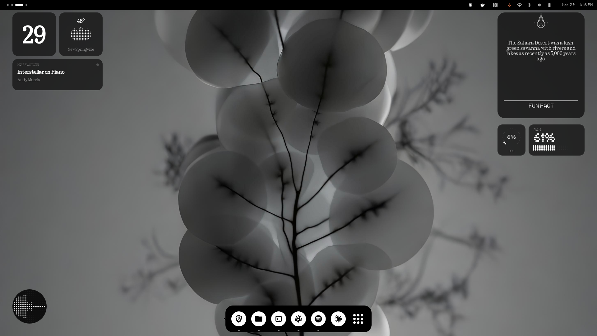

# Nothing Icons

A clean and minimal icon theme for Linux desktops, inspired by the Nothing OS aesthetic.



## Features

- **Minimalist Design**: High-contrast, dot-matrix inspired icons.
- **Dark & Light Variants**: Optimized for both dark and light desktop environments.
- **Comprehensive Coverage**: Includes application icons, status icons, and symbolic icons.
- **Automatic Scaling**: Supports standard and HiDPI displays.

## Installation

### Standard (Dark) Variant
Recommended for dark themes.
```bash
git clone https://github.com/asernasr/nothing-icons.git
cd nothing-icons
./install.sh
```

### Light Variant
Optimized for light themes (uses color inversion for PNG icons).
```bash
./install-light.sh
```

### Options
Both installation scripts support the following options:
- `-d, --dest`: Specify theme destination directory (Default: `~/.local/share/icons`)
- `-n, --name`: Specify theme name
- `-r, --remove`: Remove the theme
- `-h, --help`: Show help

## Better Together

For the full Nothing OS experience on Linux, we recommend pairing these icons with the following components:

### 1. Nothing Widgets
Desktop widgets (Audio Visualizer, Weather, System Monitors) styled with the dot-matrix aesthetic.
```bash
git clone https://github.com/asernasr/nothing-widgets.git
cd nothing-widgets
./install.sh
```

### 2. Graphite GTK Theme
These icons pair perfectly with the **Graphite GTK Theme** (Dark/Compact variant).
- Repository: [vinceliuice/Graphite-gtk-theme](https://github.com/vinceliuice/Graphite-gtk-theme)

### 3. Signature Fonts
Ensure you have the dot-matrix fonts installed for the full UI effect:
- **Ndot 55** & **NType 82**
- Available at: [xeji01/nothingfont](https://github.com/xeji01/nothingfont)

## Usage

After installation, you can apply the icon theme using your desktop's customization tool:
- **GNOME**: Use `GNOME Tweaks` -> Appearance -> Icons.
- **KDE Plasma**: System Settings -> Appearance -> Icons.
- **XFCE**: Settings -> Appearance -> Icons.

## Credits
Inspired by the Nothing OS design language.
